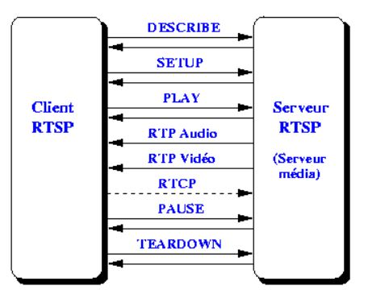
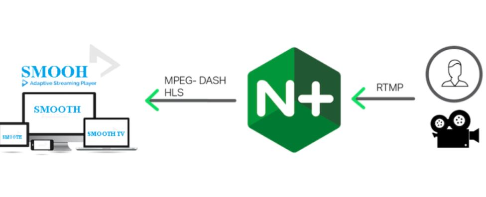
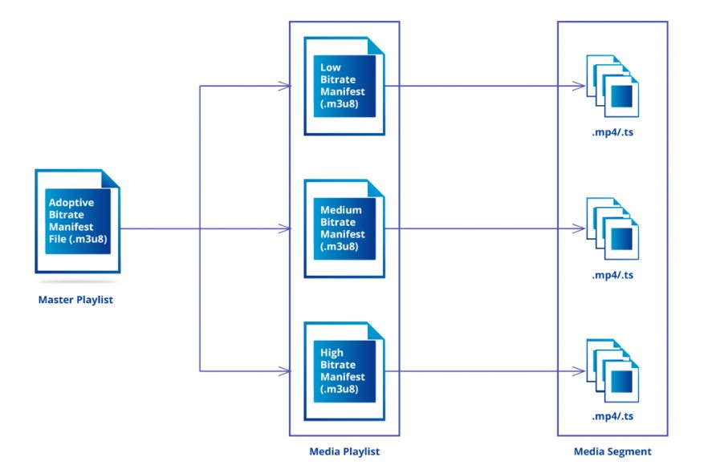
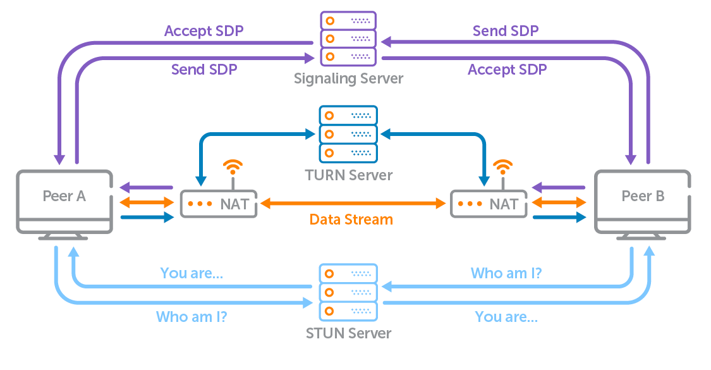
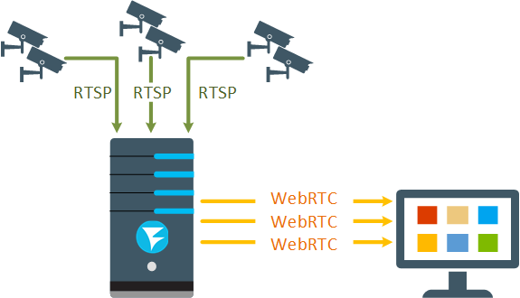
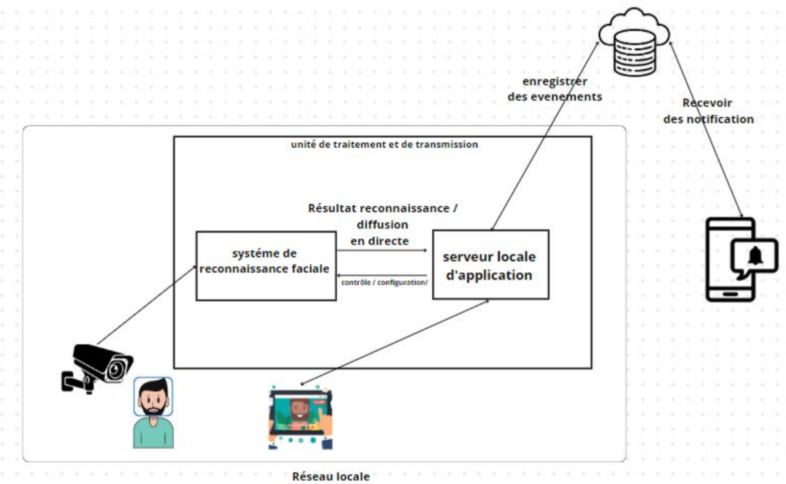
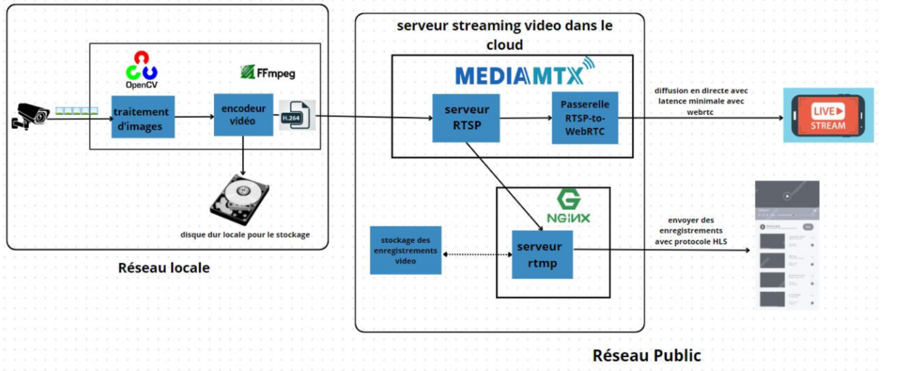
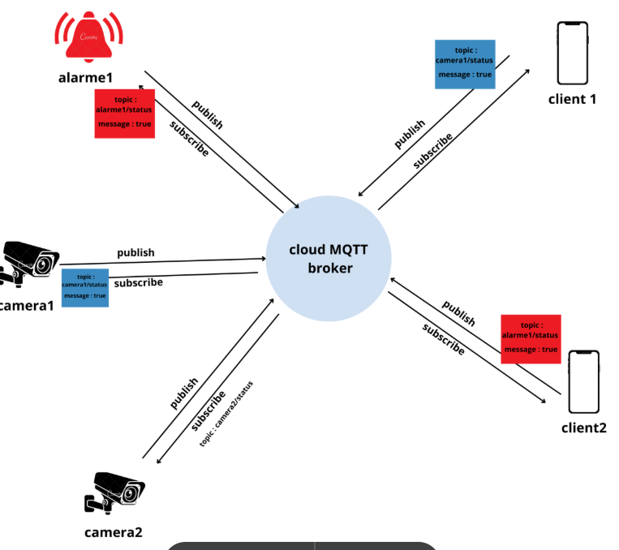

 ## ECLARISS – Smart Home Security System   🔒

ECLARISS is a **smart AI-powered surveillance system** for **real-time home monitoring**. It uses **Face Recognition, RTSP Streaming, Flask Backend**, and **YOLO-based Person Detection** to enhance home security.   


## System Overview

1. **Face Recognition & Access Control**:
 Face Recognition Model: Utilizes dlib_face_recognition_resnet_model_v1 to convert faces into embeddings (numerical representations) for comparison.

Raspberry Pi Setup: The Raspberry Pi captures real-time video through its camera, processes the face, and sends the image to the Flask API for verification.

Flask API: Manages user authentication, face recognition, and access control:

Add User: Store user face embeddings for future recognition.

Remove User: Delete user from the access database.

Verify User: Compare incoming face embeddings with stored ones to grant or deny access.

3. **Backend Using Flask**:
   - Triggers recording actions (start/stop recording).
   - Provides access to metadata for users.
   - Provides real-time live stream API links for each user.

4. **Real-time RTSP Streaming**:
   - **MediaMTX** for RTSP-to-WebRTC conversion, enabling real-time streaming.
   - **Nginx** for RTMP-to-HLS conversion, allowing recordings to be stored and accessed.

5. **Person Detection**:
   - Real-time video processing using YOLOv8: The system leverages Ultralytics YOLOv8
   - Detects persons in video frames and triggers alerts when motion or people are detected.

6. **Flask Backend**:
   - Manages APIs for **Face Recognition**, **Person Detection**, and **Video Streaming**.
   - Handles user authentication and access control, using **Firebase Authentication**.

7. **MQTT Communication**:
   - **HiveMQ** is used to trigger camera actions (start/stop recording).
   - **Mosquitto** is used for testing and sending frames via MQTT for processing.

---

## Architecture Diagrams

### 1. **RTSP Communication**

- This diagram illustrates how RTSP is used for real-time video streaming from cameras to the server.

### 2. **RTMP Architecture**

- This diagram shows the architecture for RTMP streaming, which is used for live video transmission.

### 3. **HLS Architecture**

- This diagram explains how HLS is used for adaptive streaming and storing recordings.

### 4. **WebRTC Workflow**

- This diagram demonstrates the WebRTC workflow for low-latency, real-time video streaming.

### 5. **RTSP Architecture**

- This diagram provides an overview of the RTSP architecture used in the system.

### 6. **How system work**





## Installation & Setup

### 1. Frontend Setup
```bash
# Navigate to the frontend directory
cd frontend

# Install dependencies and start the development server
npm install
npm start
```

### 2. Backend Setup

#### Raspberry Pi Camera Server
```bash
# Install FFmpeg
sudo apt-get update
sudo apt-get install ffmpeg

# Install Python dependencies for Raspberry Pi
pip install -r requirements.txt
pip install picamera2

# Start the camera server
python app.py
```

#### Main Backend Server
```bash
# Install dependencies for the main server that manages API endpoints
pip install -r requirements.txt

# Start the server for Face Recognition, Person Detection, and Video Streaming
python server.py
```

### 3. Start NGINX and MediaMTX
```bash
# Start the media server components
./mediamtx.exe
./nginx.exe
```

> **Important**: Edit configuration files to update IP addresses according to your network setup before starting the services.

### 4. Start YOLO Process RTSP
```bash
# Start the YOLO detection service
python detectionModeProcessor.py
```

### 5. MQTT Configuration
- Create an account on HiveMQ
- Add a device and obtain your API key
- Add the key to your environment variables:

```bash
# For Linux/macOS
export HIVEMQ_API_KEY="your_api_key_here"

# For Windows
set HIVEMQ_API_KEY="your_api_key_here"
```

## System Architecture
This system combines several components:
- Frontend web interface
- Raspberry Pi camera module
- Backend API server for ML models
- RTSP streaming via MediaMTX and NGINX
- YOLO object detection processing
- MQTT communication for events

## Usage
After setting up all components, access the web interface by navigating to:
```
http://localhost:3000
```


## Demo Videos

### System Overview
[](https://drive.google.com/file/d/1Fsk0TYrKU5v-nFn7cqHcPakWOvyHHkrj/preview)
*Click the image above to watch the system overview video*

### Alternative Embedding Method
<iframe src="https://drive.google.com/file/d/1Fsk0TYrKU5v-nFn7cqHcPakWOvyHHkrj/preview" width="640" height="360" allow="autoplay"></iframe>


## Troubleshooting
- Ensure all IP addresses in configuration files match your network setup
- Verify MQTT credentials are correctly set in environment variables
- Check that all required ports are open on your firewall
