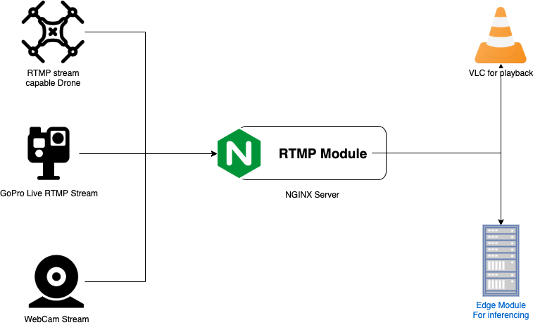
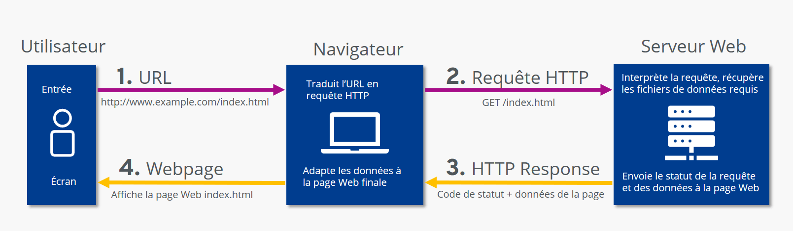

# Home Security System

A smart surveillance system integrating **Face Recognition**, **Real-time RTSP Streaming**, **Flask Backend**, and **Person Detection** using YOLO algorithms for efficient home monitoring.

---

## System Overview

1. **Face Recognition & Access Control**:
   - Raspberry Pi + Flask for user verification and access management.
   - Add/remove users and manage access permissions.

2. **Backend Using Flask**:
   - Triggers recording actions (start/stop recording).
   - Provides access to metadata for users.
   - Provides real-time live stream API links for each user.

3. **Real-time RTSP Streaming**:
   - **MediaMTX** for RTSP-to-WebRTC conversion, enabling real-time streaming.
   - **Nginx** for RTMP-to-HLS conversion, allowing recordings to be stored and accessed.

4. **Person Detection**:
   - Real-time video processing using **YOLO algorithms**.
   - Detects persons in video frames and triggers alerts when motion or people are detected.

5. **Flask Backend**:
   - Manages APIs for **Face Recognition**, **Person Detection**, and **Video Streaming**.
   - Handles user authentication and access control, using **Firebase Authentication**.

6. **MQTT Communication**:
   - **HiveMQ** is used to trigger camera actions (start/stop recording).
   - **Mosquitto** is used for testing and sending frames via MQTT for processing.

---

## Architecture Diagrams

### 1. **RTSP Communication**

- This diagram illustrates how RTSP is used for real-time video streaming from cameras to the server.

### 2. **RTMP Architecture**

- This diagram shows the architecture for RTMP streaming, which is used for live video transmission.

### 3. **HLS Architecture**

- This diagram explains how HLS is used for adaptive streaming and storing recordings.

### 4. **WebRTC Workflow**

- This diagram demonstrates the WebRTC workflow for low-latency, real-time video streaming.

### 5. **RTSP Architecture**

- This diagram provides an overview of the RTSP architecture used in the system.

### 6. **RTMP with Nginx**

- This diagram shows how Nginx is configured to handle RTMP-to-HLS conversion.

### 7. **HTTP Communication**

- This diagram explains the HTTP communication between the frontend and backend.

---

## Installation & Setup

### 1. **Frontend Setup**
- Navigate to the `frontend` directory.
- Install dependencies:
